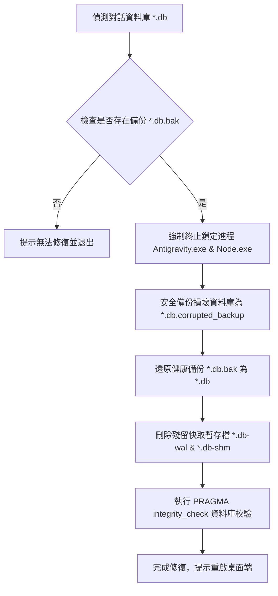

# 📂 Antigravity 2.0 對話載入故障自動修復工具 (Database Recovery Tool)

> 💡 **專案簡介**：本工具專門為了解決 **Antigravity 2.0** 桌面端（基於 Electron + SQLite + Protobuf）因資料庫二進位損壞導致的 **「對話無限 Loading」** 載入故障。
> 🔒 **代碼安全**：本專案採用安全展示設計，原始碼（*.py）已在本地排除，僅於本頁面展示技術架構與原理。

---

## ⚡ 故障成因分析 (The Problem)

在 AI 運行過程中，寫入對話軌跡至 `conversations/*.db` 時，若因非等長二進位替換（例如：將長度不同的字串直接寫入 Protobuf length-delimited 欄位），會導致 **Protobuf 長度標記與實際二進位長度不符**。
Electron 主程序在載入該對話並進行反序列化（Deserialization）時將直接崩潰，導致前端對話介面永久卡在 Loading 圖示。

---

## 🛠️ 技術修復架構與原理 (Architecture)

本修復工具在本地端執行時，會透過以下自動化流程解決「進程鎖定」與「資料快取污染」問題：

### 📋 核心修復步驟詳解

1.  **🔓 強制解除進程鎖定**
    *   由於 Electron 主程式與 Node.exe 背景進程會持續佔用並鎖定對話資料庫檔案，修復前程式會自動執行進程終止，安全釋放檔案鎖（File Lock）。
2.  **🛡️ 防禦性多重備份**
    *   在覆寫任何檔案前，主動將當前壞掉的資料庫重新命名為 `.corrupted_backup`，確保即便還原中斷，原始損壞數據依然留存，將資料風險降至 0。
3.  **🧹 快取與暫存檔清除**
    *   SQLite 資料庫在運行時會產生 `.db-wal`（預寫日誌）與 `.db-shm`（共享記憶體快取）檔案。若不清除這些檔案，重啟時依然可能因為讀取舊快取而發生衝突。
4.  **✅ 結構完整性校驗**
    *   資料庫還原後，自動呼叫 `PRAGMA integrity_check` 進行 SQL 級別的健康檢查，確保修復後的資料庫結構完美無瑕。

---

## 📄 版權與使用聲明 (Copyright & License)

> [!IMPORTANT]
> **版權所有，保留一切權利 (Copyright &copy; All Rights Reserved)**
>
> *   本專案為**非開源作品 (No License)**，僅作為個人開發作品集審閱與技術演示之用。
> *   未經原作者書面授權，**嚴禁任何形式的下載、複製、修改、散佈或用於商業用途**。
